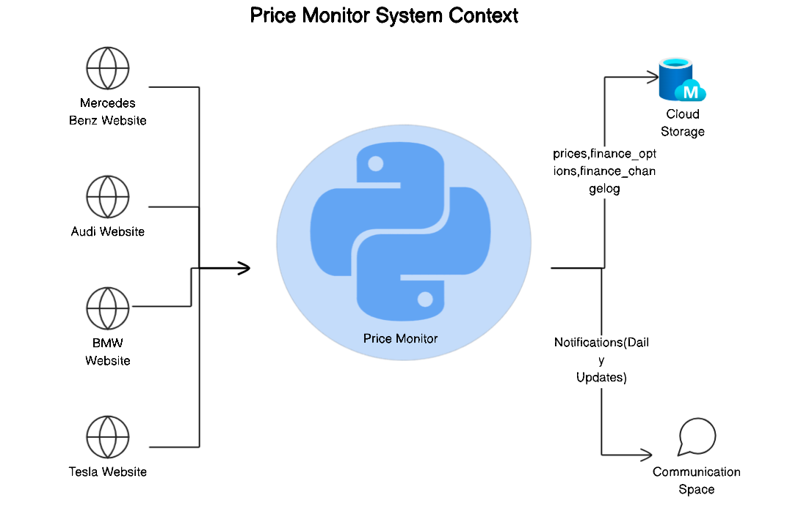
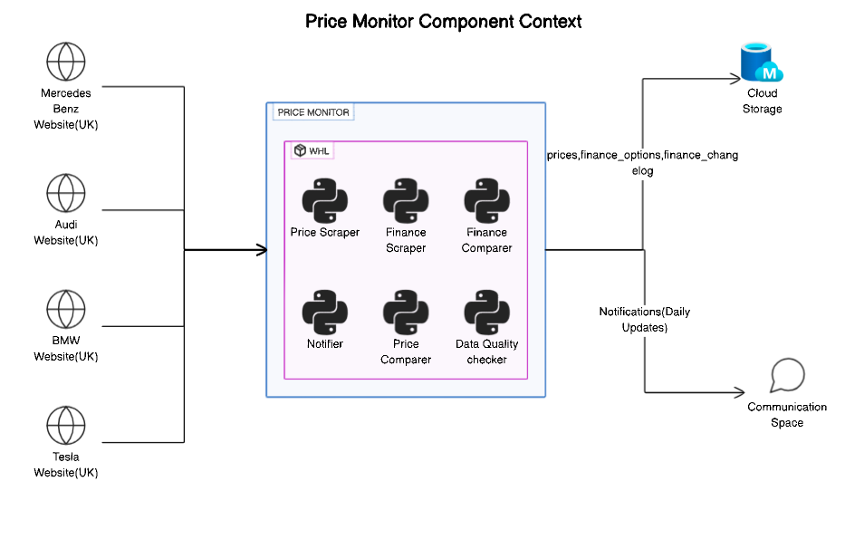

# Price Monitor

This project offers an automated tool for cataloging car models and trims from leading global manufacturers, providing detailed, up-to-the-minute information in a single platform. 
The system ensures data accuracy, relevance, and currency, adapting seamlessly to the dynamic automotive market.

Designed with scalability in mind, the tool offers low-maintenance upkeep and can be easily extended to new markets and OEMs as business needs grow.

Additionally, the tool includes an artifact store that preserves historical records, enabling features such as historical analysis and comparative insights. 
These capabilities support data-driven decision-making across various business and analytical processes.

This project includes scrapers that visit automaker websites to gather up-to-date details on their car models. 
A comparer then analyzes this data over time to identify changes in car configurations, finance and leasing terms, and on-the-road (OTR) prices. 
Finally, a notifier compiles these detected changes into a clear and understandable format for easy consumption.

## Price Monitor Components

The Price Monitor is built on a modular architecture, with each component serving a specific function. 
These include data collection through scrapers, data processing via the Comparer, additionally, a notifier component compiles and communicates the detected changes in a clear, actionable format.

The system is designed to be scalable and extensible, allowing for the addition of new features and functionalities as needed.

 ### Price Scraper

The Price Scraper module continuously collects real-time data on car pricing, trims, configurations, and package details from sources like manufacturer websites. It ensures that car prices are accurate and up-to-date, facilitating reliable comparisons across models and configurations
Further details about Price Scraper, data models, schema details can be found [here](docs/markdown/PRICE-SCRAPER-README.md)

 ### Finance Scraper

The Finance Scraper module collects comprehensive financial data related to loans, leases, and other financing options available for car purchases. It integrates data manufacturer websites to provide an exhaustive overview of interest rates, down payments, and loan terms, 
This ensures analysts can compare financial packages side by side, aiding in better decision-making.
Further details about Finance Scraper, data models, schema details can be found [here](docs/markdown/FINANCE-SCRAPER-README.md)

### Price Comparator
The Price comparator tracks and captures the differences in car models between two consecutive data collection runs (currently set to a daily comparison). 
It identifies changes such as price adjustments, modifications to car configurations (e.g., new features, updated trims, and other relevant data. 
By comparing details such as pricing, options, and configurations across runs, it provides insight into trends and anomalies, helping stakeholders quickly identify significant changes in the automotive market.

Further details about Price Comparator, data models, schema details can be found [here](docs/markdown/PRICE-COMPARATOR-README.md)

### Finance Comparator
The Finance Comparator identifies and captures any changes in financing options for car models between two consecutive runs (currently configured for a daily comparison). 
It monitors several key financial parameters, including changes in Personal Contract Purchase (PCP) monthly rental rates, On-The-Road (OTR) prices, Rate of Interest (ROI) or Annual Percentage Rate (APR) adjustments, 
and variations in optional final payments. By systematically comparing these factors, it provides valuable insights into fluctuations in financing terms, allowing stakeholders to stay informed about shifts in market conditions 
which are critical for both consumers and financial analysts.

Further details about Finance Comparator, data models, schema details can be found [here](docs/markdown/FINANCE-COMPARATOR-README.md)

### Notifications

The Notifier module delivers daily notifications summarizing the detected changes from the Price Comparator. 
These notifications highlight important changes, such as price adjustments, configuration updates, and other relevant market shifts. 
The information is communicated through a designated communication platform (such as g-chat, or Microsoft Teams), ensuring the details are presented in a clear, concise, and easily readable format. 

Further details about Finance Comparator can be found [here](docs/markdown/NOTIFICATIONS-README.md)

### Data Quality

Data quality focuses on the data's fitness for use, 
Ensuring data accuracy, completeness, consistency, and reliability.

Further details about Finance Comparator can be found [here](docs/markdown/DATA-QUALITY-README.md)

## System Architecture and Deployment Overview

## Price Monitor System Architecture 

The Price Monitor is hosted within Mercedes-Benz HQ’s AllSparks eXtollo infrastructure. 

## Price Monitor Executable

### Whl file

You can also use the Whl file distribution to run the scraper. Please ensure Python 3.11+ and Chrome browser is already installed on the host machine
Run `make install_from_whl` to have the `price-monitor` shell command installed on your host.

### Docker

You can use the `Makefile` to run the scraper using docker. Run `make build-image` to create docker image for the Price Monitor.

### Data model

The price monitor creates two datasets on every run. The output can be formatted in either `csv` or `avro` files. Defaults to `avro`.

### Cron Job Script

The `cron_script` file is used to run the scraper and store the data into the bucket.

### [Getting Started: Setup and Contribution Guidelines](docs/markdown/CONTRIBUTING.md)