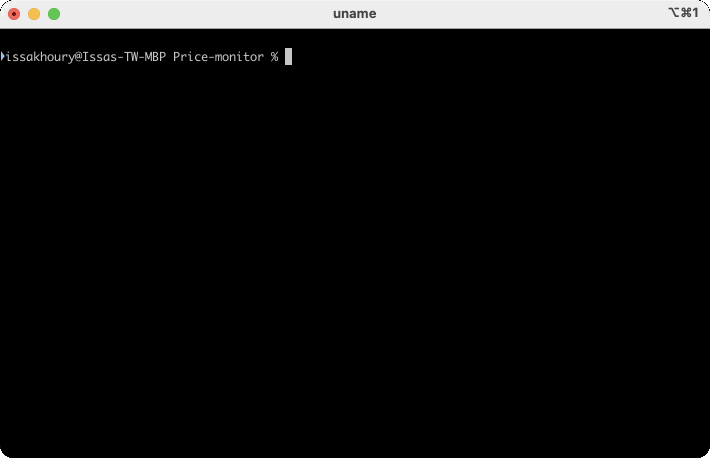

# Getting Started: Setup and Contribution Guidelines

## Development Setup

### Pre-requisites
- Pycharm community version or any other IDE is installed on the system, if not installed
- Install git on the system and ensure if installation is completed by verifying the version - [Link](https://github.com/git-guides/install-git)
  - Go to target folder location and clone the git-hub repository branch - [Link](https://docs.github.com/en/repositories/creating-and-managing-repositories/cloning-a-repository)
- Open pycharm or the preferred IDE and go to the folder where you cloned the repository and set up the virtual environment
  - Complete the virtual environment setup and activate the virtual environment - [Link](https://docs.python.org/3/library/venv.html)
- Chrome installation is required on the machine where the price scraper will be executed.
  - Steps to setup chrome in Linux system.
    - Download the Google Chrome binary using this command line ` wget https://dl.google.com/linux/direct/google-chrome-stable_current_amd64.deb`
    - Install the binary
      - For yum package manager : `yum install -y ./google-chrome-stable_current_amd64.deb`
      - For apt package manager : `apt install -y ./google-chrome-stable_current_amd64.deb`
- Moving further, [Makefile](../../Makefile) serves as the central entry point for all local development operations, including tasks like bootstrapping, 
running, building, and testing the project.

### Bootstrapping Local Environment

To bootstrap the local environment, you can use the make bootstrap_local command. 
This will install the necessary dependencies and set up the environment.
  `make bootstrap_local`

At this point, the local environment should be ready and scrapers can be executed locally.

### CLI

After the successfully bootstrapping, you can run the CLI tool in your `shell` using the `price-monitor` command: 

You can find the description of all available CLI commands [here](./CLI-README.md).
For Configuration file format, refer to the Configuration file section below.

Please refer to the Makefile for additional commands to run scrapers,  comparer in the local environment. 
Run `make` to view the list of supported commands.

## Contribution Guidelines and Release Process

### Pull Request

  * **Make A Branch** : Please create a separate branch for each task that you're working on. Do not make changes to the default branch (e.g. main).
  * **Push Your Code** : Push your code in your branch.
  * **Sync Branch** : Make sure your branch is sync with main. 
  * **Make a pull request** : Create a pull request to main branch. 
    >   Note : Make sure to follow Code Guidelines before creating a PR.
  * **Request Review**: Request each team member as reviewer for the PR.

### Code Guidelines

  * Keep functions small and modular and name variables descriptively.
  * Strive to write readable code and add comments where necessary.
  * Make sure all the existing tests pass.
    * Command : `make test`
  * Make sure your code is well formatted.
    * Command : `make format`
  * Commit Format : [ Add/Refactor/Remove/Temp ] Commit Message
    > Note : Temp used for temporary changes.

### Release Process For Production

> We follow [semantic versioning](https://semver.org/) for versioning our release candidate.
  * Bump Version
    * **Format** : `X.Y.Z`
      * X : For Major breaking changes. Ex. New data storage format.
      * Y : For new compatible features. Ex. New vendor or market.
      * Z : For bug fixes and refactoring.
    * **Command to update version** : `poetry version X.Y.Z`
  * Create tag
    * **Format** : `vX.Y.Z`
  * Generate Release Document
  * Publish New Release
    > Note : Deployment Pipeline takes around ~30-35 minutes for release as we are running end-to-end tests only for release.

### Formatting

> We use [black](https://pypi.org/project/black/) and [isort](https://pycqa.github.io/isort/) for formatting the code
  * Run command: `git config core.hooksPath .githooks` to add pre-commit hook to run the test and also style check before commiting
  * You can then run the command: `isort --profile black .` to format the code using isort with the black profile

### Environments 

* Staging
  * Our Internal Environment For Testing.
  * Each commit in main will automatically deploy to staging.
* Production
  * Used By Clients.
  * Need manual review and release process.

Each environment captures logs of the scraper runs from the standard output. Currently, these can be viewed in Google Cloud dashboards.

### Managing Schema Changes in Looker Studio

As we make changes in Data Models(LineItem, DifferenceItem, PriceDifferenceItem, OptionPriceDifferenceItem, FinanceLineItem) 
we need to update the associated BigQuery Tables & Looker Studio data sources to reflect the changes.
Following have been added as steps required to accommodate the schema change. 

Below steps depicts the impact of changing LineItem data model and its impact on Big query table 'prices' and Big query view 'latest_prices'.

BigQuery Table:

* Update BigQuery Tables (ex- prices for LineItem) to include the new field(add/remove existing fields)
* Recreate views associated with it (ex- latest_prices view for prices table)

Looker Studio:
* Remove existing datasource linked with view (ex- latest_prices for prices table)
* Recreate the datasource with all the new dimensions
* Update existing dashboards with the created datasource for all the required dimensions

### Steps to Access Docker Logs from Container

- Authenticate gcloud : `gcloud auth login`
- Login to the server : `gcloud compute ssh VM-NAME --tunnel-through-iap`
  - VM-NAME
    - Production : price-monitor
    - Staging : staging-price-monitor
- List out the containers : `sudo docker ps -a` 
- Output the logs of specific container : `docker logs container_id`
